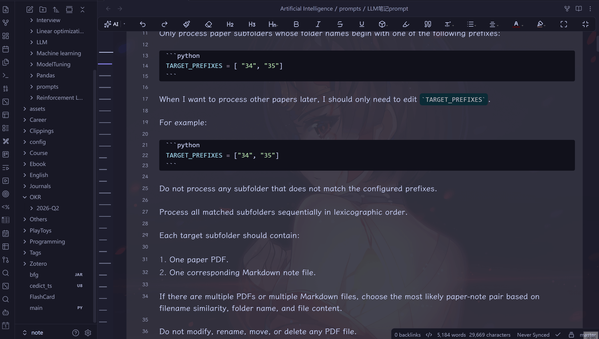

<div align="center">

# Vault OKR Manager

在 Obsidian Vault 中直接规划、追踪和复盘 OKR，提供专用 Dashboard、内嵌进度历史，以及完全本地的 Markdown 存储。


[English README](./README.md) · [功能特性](#功能特性) · [安装方法](#安装方法) · [快速开始](#快速开始) · [使用说明](#使用说明) · [常见问题](#常见问题)

</div>

---



## 简介

Vault OKR Manager 是一个 Obsidian 社区插件，用于在你的 Vault 中管理 Objective 和 Key Result。

当前版本的核心存储模型是：

- 一个 Objective 对应一个 Markdown 文件
- 该 Objective 下的所有 KR 当前状态都保存在同一个文件的 YAML frontmatter 中
- 每次进度更新会追加到正文的 `## 进度记录` 区域，方便阅读和复盘

这种方式比“每个 KR 一个文件”或“每次 Check-in 一个文件”更整洁，也更符合长期维护、同步和版本管理的需要。

插件坚持本地优先：

- 不依赖外部数据库
- 不依赖云服务
- 不包含隐藏遥测
- 不会把 Vault 数据发送到外部

## 功能特性

- 每个 Objective 只保留一个文件，KR 当前状态与进度历史均内嵌存储
- Dashboard 统一查看各周期目标、关键结果、进度和超期状态
- 支持周、月、季度、年四种周期
- 自动计算 KR 与 Objective 进度
- 内置进度记录流程，支持同一天多次更新
- Dashboard 中支持拖拽排序关键结果
- 支持超期提醒与截止日期延期
- 默认英文，支持简体中文界面
- 纯 Markdown 本地存储，适合同步和 Git 管理

## 系统要求

| 项目 | 要求 |
|------|------|
| Obsidian | `1.7.2` 及以上 |
| 平台 | Windows / macOS / Linux / iOS / Android |
| 插件 ID | `vault-okr-manager` |
| 桌面独占 | `false` |

## 安装方法

### 通过社区插件市场安装

如果插件已经进入 Obsidian 官方社区插件目录：

1. 打开 Obsidian。
2. 进入 **Settings → Community plugins**。
3. 如果安全模式开启，先关闭。
4. 选择 **Browse**。
5. 搜索 `Vault OKR Manager`。
6. 安装插件。
7. 启用插件。

### 手动安装

1. 打开最新 Release 页面：[Releases](https://github.com/jingmengzhiyue/obsidian-okr-manager/releases/latest)
2. 下载以下发布文件：
   - `main.js`
   - `manifest.json`
   - `styles.css`
3. 打开你的 Vault 目录。
4. 进入 `.obsidian/plugins/`。
5. 创建文件夹 `vault-okr-manager`。
6. 将上述三个文件复制进去。
7. 重启 Obsidian，或重新加载社区插件。
8. 在 **Settings → Community plugins** 中启用 **Vault OKR Manager**。

```text
你的 Vault/
└── .obsidian/
    └── plugins/
        └── vault-okr-manager/
            ├── main.js
            ├── manifest.json
            └── styles.css
```

## 快速开始

### 1. 检查默认设置

打开 **Settings → Vault OKR Manager**，确认这些默认值：

| 设置项 | 默认值 | 说明 |
|------|------|------|
| `Objective directory` | `OKR` | 所有目标文件的根目录 |
| `Default period type` | `quarter` | 新建目标时默认使用的周期类型 |
| `Auto-calculate progress` | `true` | 当前值或目标值变化时自动重算进度 |
| `Open dashboard on startup` | `false` | 启动 Obsidian 时自动打开 Dashboard |

### 2. 创建第一个 Objective

1. 用 `Ctrl+P` 或 `Cmd+P` 打开命令面板。
2. 执行 **New objective**。
3. 选择周期类型：
   - Week
   - Month
   - Quarter
   - Year
4. 输入周期值，例如：
   - 周：`2026-W20`
   - 月：`2026-05`
   - 季度：`2026-Q2`
   - 年：`2026`
5. 输入标题、负责人、描述和截止日期。
6. 点击 **Create**。

插件会创建类似 `OKR/2026-Q2/O1.md` 的文件。

### 3. 添加 Key Result

1. 执行 **New key result**。
2. 选择周期和所属 Objective。
3. 输入 KR 标题、负责人、单位、当前值、目标值、信心等级，以及需要时的截止日期。
4. 点击 **Create**。

此时不会生成单独的 KR 文件，而是直接写入对应的 Objective 文件。

### 4. 记录进度

1. 执行 **Record progress**。
2. 选择一个 KR。
3. 输入最新当前值，或直接调整进度百分比。
4. 可选填写进展说明和阻碍因素。
5. 保存更新。

进度历史会追加到 Objective 文件正文的 `## 进度记录` 区域，因此同一天也可以多次记录，不会额外生成文件。

### 5. 打开 Dashboard

1. 执行 **Open dashboard**。
2. 在侧边栏查看目标、关键结果、进度、截止日期与超期状态。
3. 需要时可直接拖拽 KR 调整顺序。

## 使用说明

### 当前存储结构

默认情况下，目录结构类似这样：

```text
OKR/
└── 2026-Q2/
    ├── O1.md
    └── O2.md
```

当前版本不再创建：

- 每个 KR 一个独立文件
- 每次 Check-in 一个独立文件
- 专门的 `Check-ins` 目录设置项

现在所有相关数据都聚合在 Objective 文件中：frontmatter 保存当前状态，正文保存可读的进度日志。

### 命令列表

命令名称会跟随插件当前语言显示。英文环境下的命令如下：

| 命令 | 用途 |
|------|------|
| `New objective` | 创建新目标 |
| `New key result` | 给目标添加 KR |
| `Record progress` | 记录 KR 进度更新 |
| `Open dashboard` | 打开或聚焦 OKR Dashboard |
| `Migrate legacy progress records` | 将旧 frontmatter 进度记录批量迁移到正文 |

如果 Obsidian 当前使用简体中文，插件界面和命令名称会自动切换为中文。

### 周期格式

| 类型 | 格式 | 示例 |
|------|------|------|
| 周 | `YYYY-Www` | `2026-W20` |
| 月 | `YYYY-MM` | `2026-05` |
| 季度 | `YYYY-Qn` | `2026-Q2` |
| 年 | `YYYY` | `2026` |

### Objective 文件模型

每个 Objective 文件包含：

- Objective 元数据
- `key-results` 数组，用于保存 KR 当前状态
- 正文 `## 进度记录` 区域，用于保存每次 check-in 历史
- 插件渲染 KR 内容的保留区域

示例：

```markdown
---
okr-type: objective
okr-id: O1
okr-period: 2026-Q2
okr-period-type: quarter
title: 提升工程质量
owner: 团队负责人
status: active
progress: 68
due: 2026-06-30
key-results:
  - okr-id: O1-KR1
    title: 代码评审覆盖率达到 100%
    current: 80
    target: 100
    progress: 80
    order: 0
---

## 背景

提升工程质量。

## Key Results

<!-- OKR-KR-LIST -->
插件会在这里渲染 KR 列表。
<!-- /OKR-KR-LIST -->

## 进度记录

<!-- OKR-CHECKINS-START -->
### O1-KR1 进度记录

- **2026-05-18** 80% (+10) `O1-KR1-1740000000000`
  - recordedAt: 2026-05-18T09:00:00.000Z
  - note: 已提升后端模块代码评审覆盖率
  - blocker:
<!-- OKR-CHECKINS-END -->
```

### 进度规则

KR 进度：

- `boolean`：完成则 `100%`，否则 `0%`
- 其他数值单位：`current / target * 100`
- `target <= 0` 时返回 `0%`
- 最终进度限制在 `0–100`

Objective 进度：

- 取所有未取消 KR 的平均值
- 没有有效 KR 时为 `0%`

### KR 排序

- Dashboard 支持拖拽排序关键结果。
- 新顺序会持久化写回 Objective 文件。
- 详情视图仍保留移动操作作为兜底交互。

### 超期目标

当 Objective 超过截止日期且状态不是完成或取消时，插件会：

- 标记为超期
- 在 Dashboard 中显示提醒
- 用视觉样式突出风险状态
- 提供延期入口以更新截止日期

### 语言行为

- 默认语言：英文
- 支持语言：简体中文（`zh-CN`）
- 未识别或未支持的语言会回退到英文
- 切换界面语言不会自动改写已存在的 Markdown 笔记内容

### 旧数据模型说明

当前版本不兼容以下旧原型模型：

- 每个 KR 一个独立 Markdown 文件
- 每次进度记录一个独立 Check-in 文件
- 在设置页中配置独立的 Check-in 目录

如果你过去使用过旧原型，需要手动将独立文件整理到当前的 Objective 聚合结构中。

如果你已经有旧版 Objective 文件，并且进度历史还保存在 frontmatter 的 `checkIns` 数组里，1.2.1 会继续读取这些旧数据。你可以执行 **Migrate legacy progress records** 一次性迁移当前 OKR 目录下的旧记录；也可以等下次通过插件记录进度、编辑 KR、调整排序或更新目标时，让插件自动把对应文件的旧 `checkIns` 转换为正文 `## 进度记录` 区域，并从 frontmatter 中移除历史数组。

## 常见问题

### 现在还会给每个 KR 单独建文件吗？

不会。KR 已经内嵌在 Objective 文件中。

### 现在还会创建 `Check-ins` 文件夹吗？

不会。进度历史保存在 Objective 文件正文的 `## 进度记录` 区域中。

### 同一天可以记录多次进度吗？

可以。当前版本支持同一天多次记录。

### Objective 超期后会怎样？

Dashboard 会显示超期提醒和状态标识，你也可以直接从界面里延期截止日期。

### 会上传数据到云端吗？

不会。所有数据都保存在本地 Vault 中。

### 可以不用季度，改用周或月吗？

可以。插件支持周、月、季度、年四种周期。

### 支持手机端吗？

支持，插件不是桌面独占。

## 待办路线图

以下待办清单基于当前实现的静态审查结果，优先级按照稳定性、性能和 OKR 管理完整性排序。

### P0：稳定性与流畅度

- [x] 在行内操作后立即刷新当前 Markdown 预览，包括记录进度、编辑、删除、新增 KR、延期等操作
- [x] 减少由弹窗回调和元数据事件同时触发的重复 Dashboard 刷新
- [x] 将 Objective 文件发现逻辑从全 Vault 扫描改为仅在已配置 OKR 根目录下查找
- [ ] 为 KR 建立快速索引，避免记录进度和定位目标时跨周期扫描

### P1：OKR 核心流程完善

- [ ] 增加周期规划能力，例如模板、未完成事项结转、周期归档与关闭
- [ ] 增加结构化评审流程，例如周回顾、中期评审、周期复盘
- [ ] 为 Dashboard 增加 owner、状态、周期、超期状态等筛选与搜索能力
- [ ] 丰富 Check-in 内容，支持下一步计划、风险等级、里程碑说明和证据链接

### P2：管理深度与报表能力

- [ ] 支持 KR 权重或比简单平均更合理的健康度评分
- [ ] 增加周期趋势视图和汇总报表
- [ ] 支持导出 Markdown 或 CSV 摘要
- [ ] 提升多人协作能力，不再只依赖单个自由文本 owner 字段

## 开发

需要 Node.js `20` 或更高版本。

```bash
git clone https://github.com/jingmengzhiyue/obsidian-okr-manager.git
cd obsidian-okr-manager
npm install
npm run dev
```

常用命令：

```bash
npm run build
npm run lint
npm test
```

发布前请确认：

1. 更新 `manifest.json`
2. 更新 `package.json`
3. 更新 `versions.json`
4. 运行 `npm run build`
5. 在 GitHub Release 中单独上传 `main.js`、`manifest.json`、`styles.css`

## 隐私与数据

Vault OKR Manager 完全在本地运行：

- 不执行远程代码
- 不包含隐藏遥测
- 不依赖外部 API

## 许可证

本项目使用 [MIT License](./LICENSE)。
